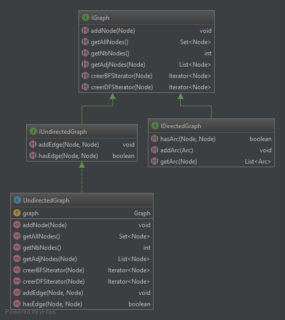
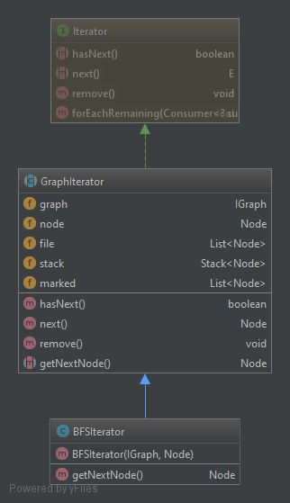
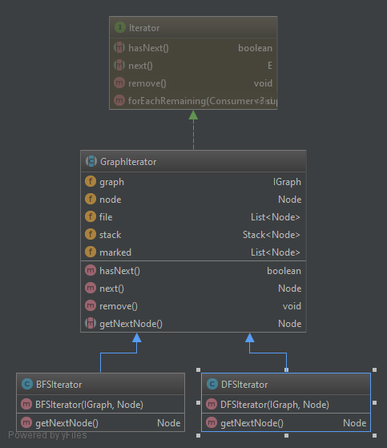

**DOLLE Jérémy**

**PETITCUENOT Mélanie**

# Rapport TP1

## Question 1

getAllNodes() :  la méthode récupère les clés grâce à la méthode _keySet()_ depuis le tableau _adjacence_ puis  les stock 
dans une liste.

```java
    public Set<Node> getAllNodes(){
		return adjacence.keySet();
	}
```

getNbNodes() : la méthode retourne la taille de la liste générée par getAllNodes().

```java
    public int getNbNodes(){
		return getAllNodes().size();
	}
 ```
 
getAdjNodes(Node _n) : la méthode récupère tous les arcs du noeud renseigné en paramètre, puis pour chaque arc, elle véréfie 
que  _n est bien la source et stocke la destination dans une liste _adjNodes_ qui est retournée à la fin. 

```java
    public List<Node> getAdjNodes(Node _n){
		List<Arc> adjArcs = adjacence.get(_n);
		List<Node> adjNodes = new ArrayList<Node>();
		for (Arc arc : adjArcs)
		{
			if (_n == arc.getSource())
				adjNodes.add(arc.getDestination());
		}
		return adjNodes;
	}
 ```

toString() : la méthodfe récupère les différentes données grâce aux différentes méthodes codées si dessus, puis les affiche. 

```java
    public String toString() {
		StringBuilder stringBuilder = new StringBuilder();

		stringBuilder.append("Graph\n");
		for (Node node : getAllNodes())
		{
			stringBuilder.append("[noeud=" + node + " : [");
			if (!getAdjNodes(node).isEmpty())
					stringBuilder.append(node.getLabel() + "=>");
			for(Node adjNode : getAdjNodes(node))
			{
				stringBuilder.append(adjNode.getLabel() +"(" + hasArc(node,adjNode) + ")]");
			}
			stringBuilder.append("\n");
		}
		return stringBuilder.toString();
 ```
		
## Question 2

La classe _UndirectedGraph_ a pour interface la classe _IUndirectedGraph_. Elle a pour attribut un graphe dont on se sert 
pour implementer la plus part des méthodes. Seule la méthode _addEdge(Node n1, Node n2)_ est implémentée sans utiliser le graph.

_addEdge(Node n1, Node n2)_ crée un arc non-orienté entre les deux noeuds, pour cela un arc n1 -> n2 est ajouté à la liste d'arc
puis son inverse (n2 => n1).

```java
    public void addEdge(Node _node1, Node _node2) {
        Arc arcA = new Arc(_node1,_node2,null);
        Arc arcR = new Arc(_node2,_node1,null);
        graph.addArc(arcA);
        graph.addArc(arcR);
    }
```

_Diagramme :_




## Question 3

Le parcours a été implémenté dans la classe _GraphIterator_. 
Ce qui définit s'il s'agit d'un parours en largeur ou en profondeur est la manière dont on récupère les éléments 
dans la liste.


Pour le parcours en largeur, on stocke tous les sommets dans une liste
puis on récupère le premier élément de cette liste lorsqu'on a besoin d'un sommet. (First in, first out)

```java
    public Node getNextNode() {
        return file.isEmpty() ? null : file.get(0);;
    }
```

_Diagramme :_




## Question 4

Pour le parcours en profondeur, on stocke les sommets dans une liste. Mais cette fois, losrqu'on a besoin d'un sommet,
on récupère le dernier élément de la liste. (Last in, first out)

```java
    public Node getNextNode() {
        return file.isEmpty() ? null : file.get(file.size()-1);
    }
```

_Diagramme :_


